# ilastik ImageJ modules

_(c) Carsten Haubold, Image Analysis and Learning Lab, HCI/IWR, University of Heidelberg._

This repository contains ImageJ2 plugins that wrap ilastik workflows for usage in [ImageJ](https://imagej.net) and [KNIME](https://www.knime.com). Data transfer is managed through temporary HDF5 file export/import. The ilastik workflows are invoked by running the ilastik headless mode from the command line.

Currently, three workflows are wrapped: Pixel classification, Object classification and tracking. There is one additional setting showing up in the ImageJ menu, which configures the location of the ilastik binary.

## User documentation

The ilastik workflow wrappers can be found in ImageJ under `Plugins -> ilastik`, or in KNIME in the `Community Contributions -> KNIME Image Processing -> ImageJ2 -> Plugins -> ilastik`.

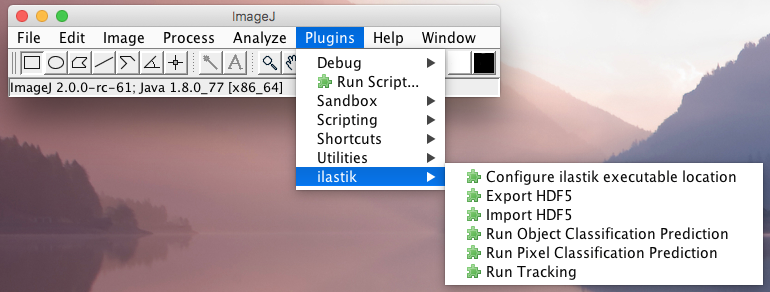

### General

All Plugins output status information to log files, so we suggest to keep an eye at the ImageJ `Windows -> Console`.

All workflow wrappers have the option to produce only the input files, so that you can use those to train an ilastik project. **TODO** write more!

### Configuration
Found at `Plugins -> ilastik -> Configure ilastik executable location`.

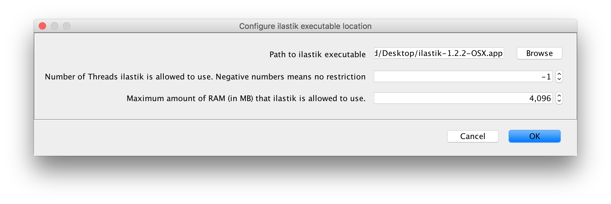

* Path to ilastik executable: choose the location of your ilastik binary executable
* Number of threads to use (-1 for no limit)
* Specify an upper bound of RAM that ilastik is allowed to use

### Pixel Classification
Found at `Plugins -> ilastik -> Run Pixel Classification Prediction`.

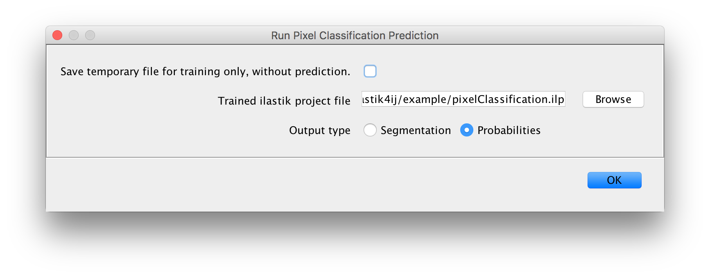

**Inputs:** 

* a raw image on which to run the pixel classification (if only one is opened, there is no selection in the dialog) 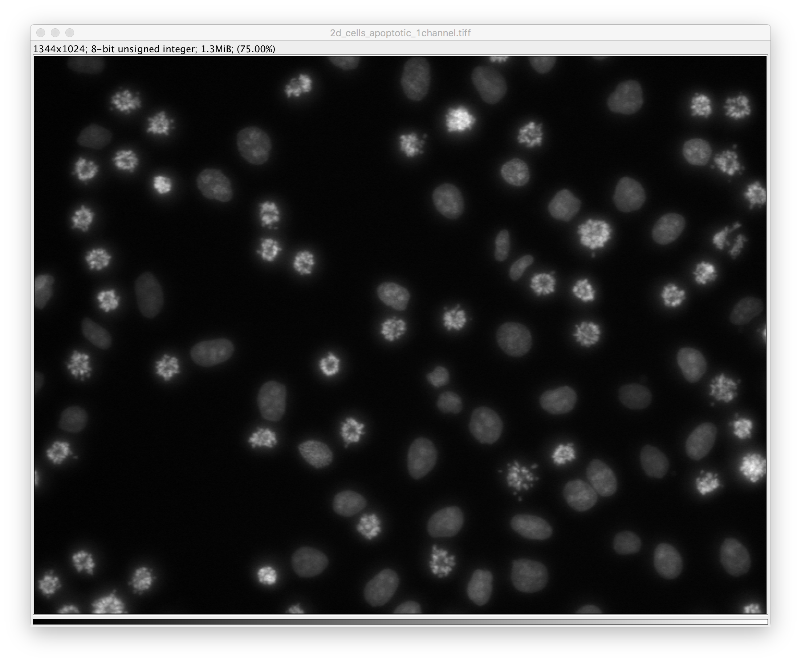
* a project file
* whether to produce per-pixel probabilities, or a segmentation

**Output:**

* if _Probabilities_ was selected: a multi-channel float image that you can _e.g._ threshold to obtain a segmentation 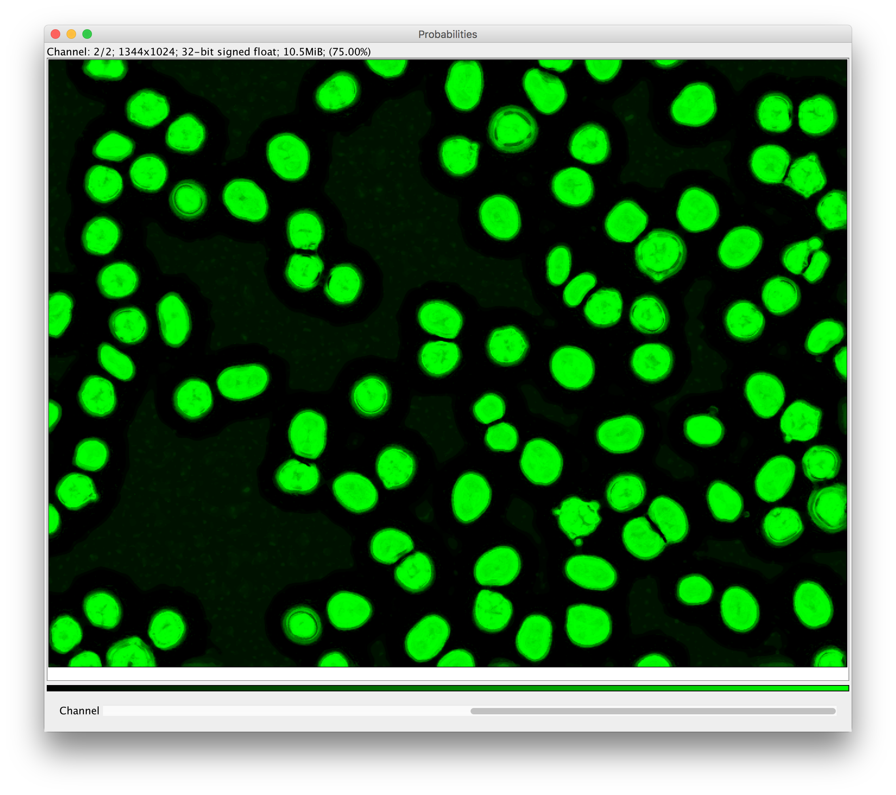
* or a _Segmentation_:a single-channel image where each pixel gets a value corresponding to an _object ID_ inside a _connected component_. 

### Object Classification
Found at `Plugins -> ilastik -> Run Object Classification Prediction`.

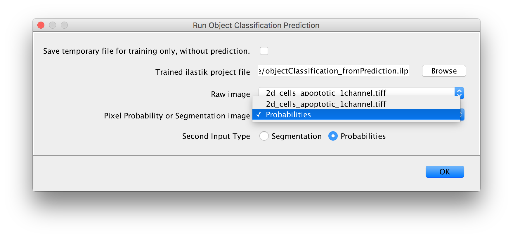

**Inputs:** 

* a project file
* one raw image (select the appropriate one in the dropdown box as shown above)
* one additional image that contains either per-pixel probabilities or a segmentation
* select the appropriate input type (_Probabilities_ or _Segmentation_)

**Output:**

* a new image where the pixels of each object get assigned the value that corresponds to the class that was predicted for this object. 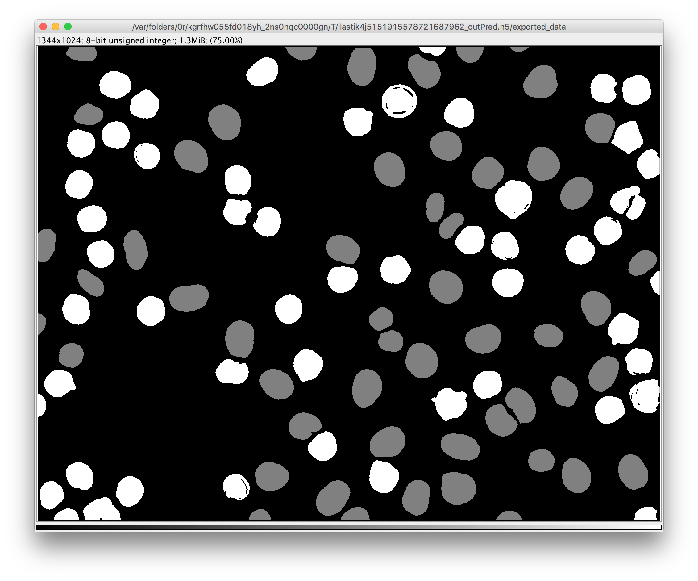

### Tracking
Found at `Plugins -> ilastik -> Run Tracking`.

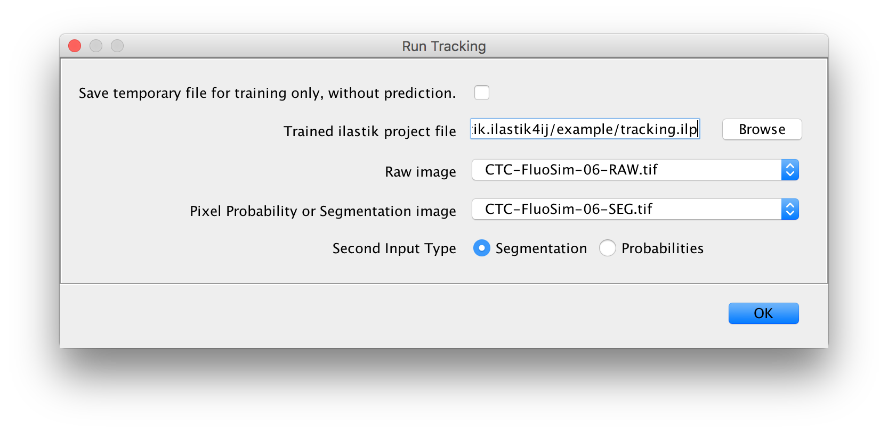

**Inputs:** 

* a project file
* one raw image (with a time axis!) 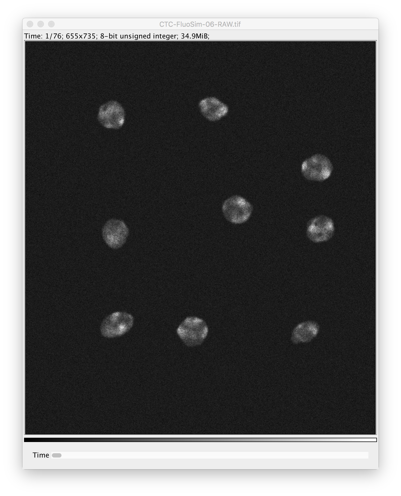
* one additional image that contains either per-pixel probabilities or a segmentation with the same dimensions as the raw image. 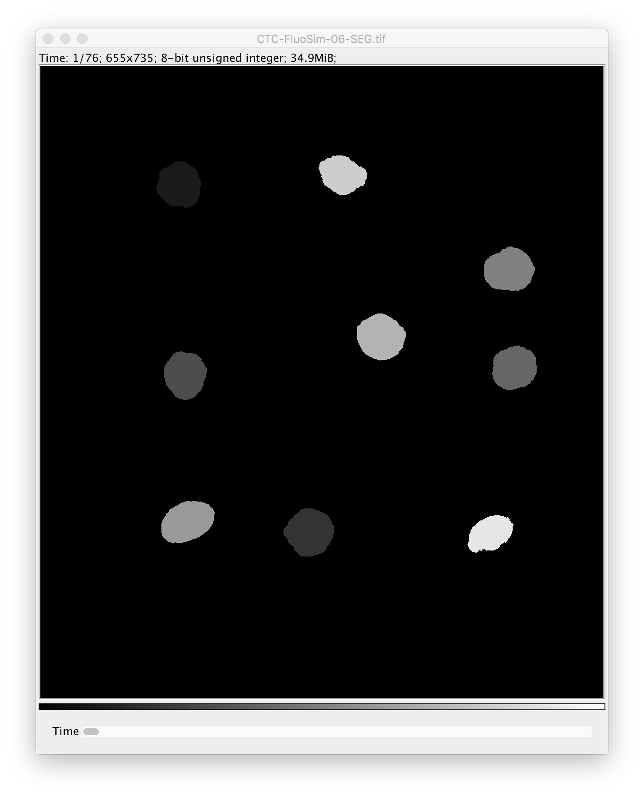
* select the appropriate input type (_Probabilities_ or _Segmentation_)

**Output:**

* a new image stack where the pixels of each object in each frame get assigned the value that corresponds to the _lineage ID_ of the tracked object. Whenever an object enters the field of view it will be assigned a new _lineage ID_. All descendants of this object will be assigned the same _lineage ID_. 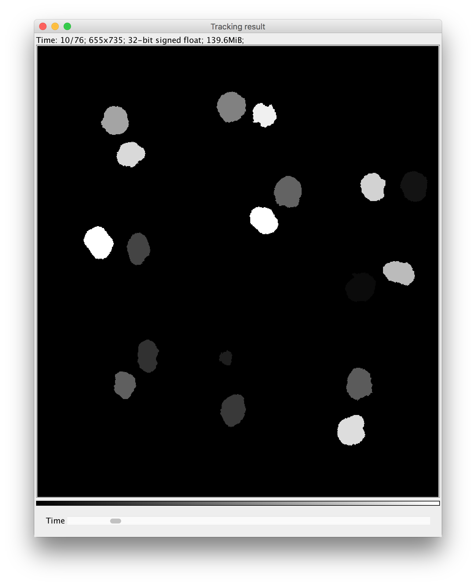

### Usage in KNIME

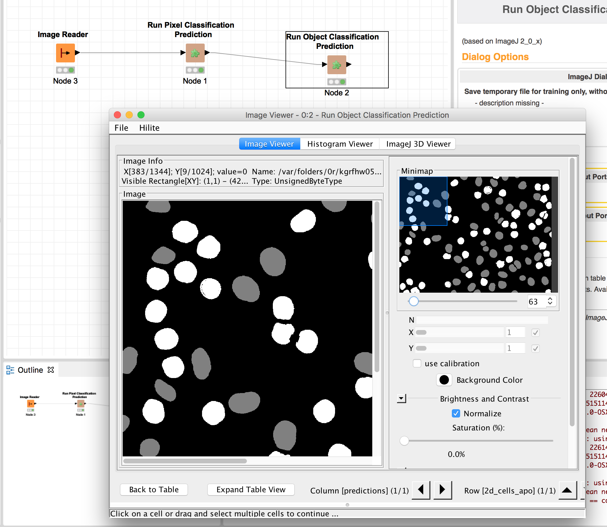

## Developer documentation

The workflow wrappers are ImageJ2 plugins (see https://imagej.net/Writing_plugins), annotated with `@Plugin` for automated discovery by the _scijava_ plugin architecture, and derived from `Command` to be an executable item. Each command can have multiple `@Parameter`s, which are to be provided by the user in an auto-generated GUI (see https://imagej.net/Script_Parameters for a list of which parameters are allowed). One can have multiple `Dataset`s as input parameters, but the output should be an `ImgPlus` (an ImageJ2 datastructure wrapping an [ImgLib2](https://imagej.net/ImgLib2) `Img` with metadata) so that the result pops up as new window. A `Dataset` is a wrapper around an `ImgPlus`.

**Attention:** there are ImageJ 1 and ImageJ 2 containers for images. In ImageJ 1, images were stored as `ImagePlus`, containing `ImageProcessors` to access the underlying data. We try to use ImageJ 2 containers everywhere which are roughly wrapped as `Dataset > ImgPlus > Img > RandomAccessibleInterval`.

**Testing:** no real tests are included right now, but you can run the `main` method in `WorkflowTests.java` which fires up an ImageJ instance for each of the three plugins.

### Deployment

We follow the setup of other `scijava` modules and use their Travis setup that allows us to automatically deploy Maven artifacts (built modules) as explained [here](https://imagej.net/Travis). The project configuration, including dependencies, is contained in the `pom.xml` file. To create a new release, use the `release-version.sh` script from https://github.com/scijava/scijava-scripts, which goes a long way of ensuring that the project is ready to be published. Once it is released, the nightly build of KNIME Image Processing (KNIP) will pick it up and wrap it as well.